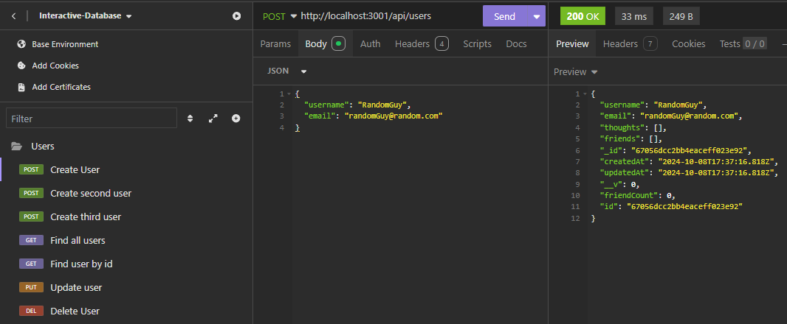
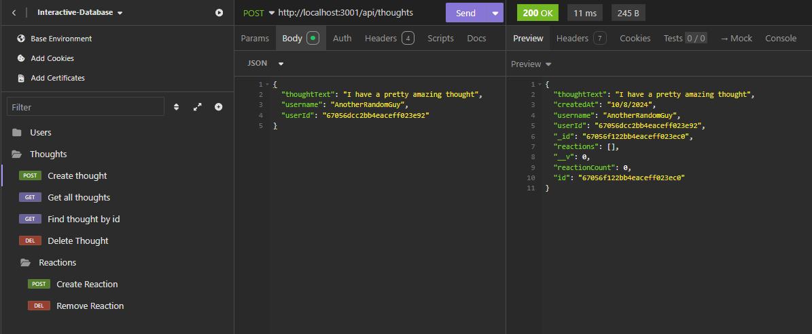
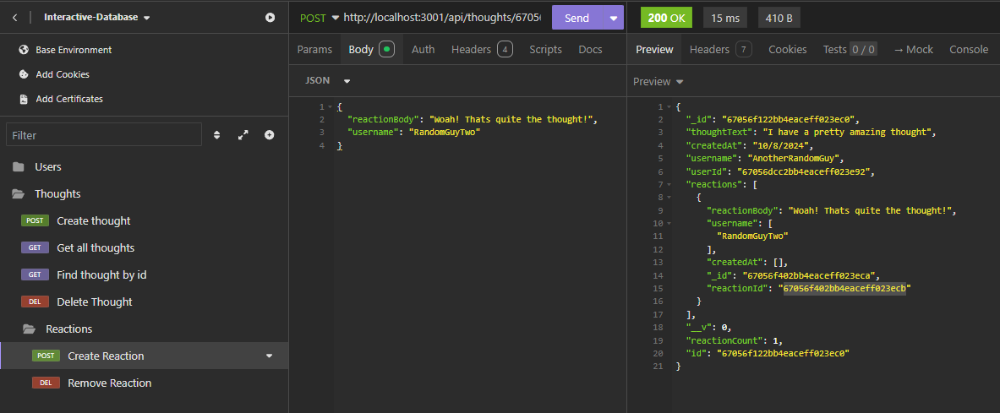

# Interactive-Database


### Table of Contents
- [Description](#description)
- [How to Install](#how-to-install)
- [Usage](#usage)
- [License](#license)
- [Contributors](#contributors)
- [Questions](#questions)
- [Application Images](#application-images)

---

## Description

This application is used to create and store data using Mongoose DB. You are given the ability to do CRUD (Create, Read, Update, Delete) operations on Users and their associated "Thoughts". Along side also creating and deleting "Reactions" to those Thoughts. The way I used this program was with the Insomnia Application. Which allows for creating API calls to the server when it is running on http://localhost:3001. 

Demo Video - https://drive.google.com/file/d/1Wv6cWlSUwqBB2EevRTYDQgTj_4z2bchj/view

## How to Install

These steps are used to install and start the application:

1. **Clone the Repository**:

   ```bash
   git clone git@github.com:Runnerrupert/Interactive-Database.git
   ```

2. **Navigate to the Project Directory**:

   ```bash
   cd your-repository
   ```

3. **Install Dependencies**:

   ```bash
   npm install
   ```
4. **Build Application**:

   ```bash
   npm run build
   ```
   
5. **Start the Application**:
   ```bash
   npm run start
   ```
6. **Use Insomnia with this URL**:

   ```bash
   http://localhost:3001
   ```

## Usage

**Create the API Request**:

   - Create a new Collection.
   - On the left side, using the + button, create a HTTP Request.
   - Within the params, choose your desired request (Get, Post, Put, Delete).
   - Type in the required API endpoint depending on your chosen request.
   - For any Post/Put requests make sure you are choosing the JSON input for the body.
   - Put in any required information within the Body, if it is a Post/Put request, or if you are deleting a Reaction.

**Send the API Request**:

   - Click the Send button next to the URL to see the JSON Result.

Create User Example:  
  
---

## License

For more information about the MIT license, use this link!
 https://memgraph.com/blog/what-is-mit-license

For a better understanding, I give you permission to use, copy, modify, distribute and sell copies at your own discretion.

---

## Contributors

University Of Utah Coding Bootcamp and Cameron Barfuss

Specifically, The coding bootcamp has taught different code practices to use to be able to create a functioning database application, I built the whole program from the ground up, but not without code given by the University of Utah Coding Bootcamp.

---

## Questions

My Github: https://github.com/Runnerrupert

My Email Address: Cameron.barfuss@gmail.com

You can contact me using my Github link or via Email if you have any questions about Interactive-Database.

--

## Application Images



  